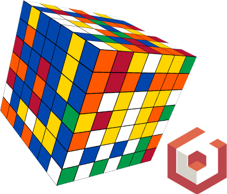
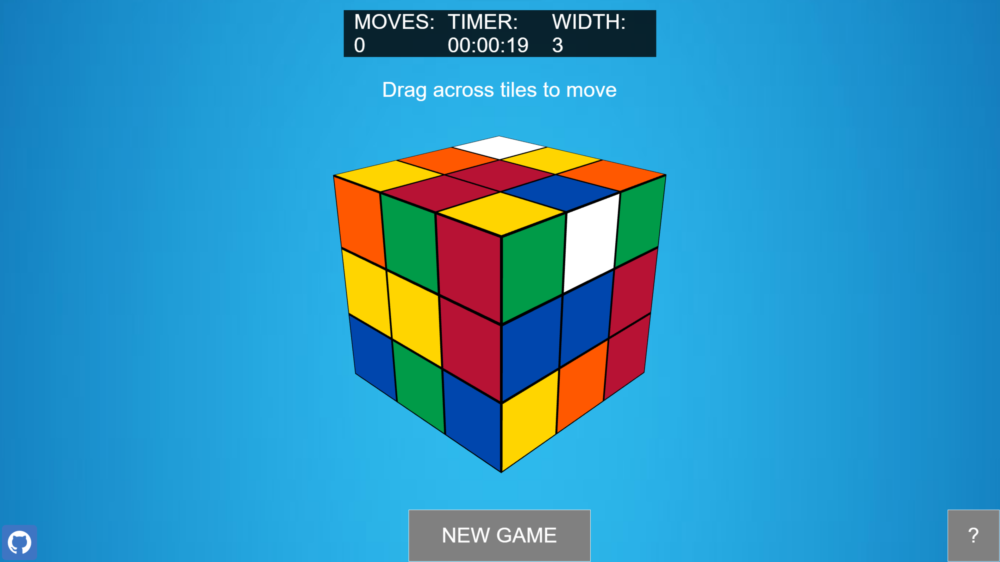
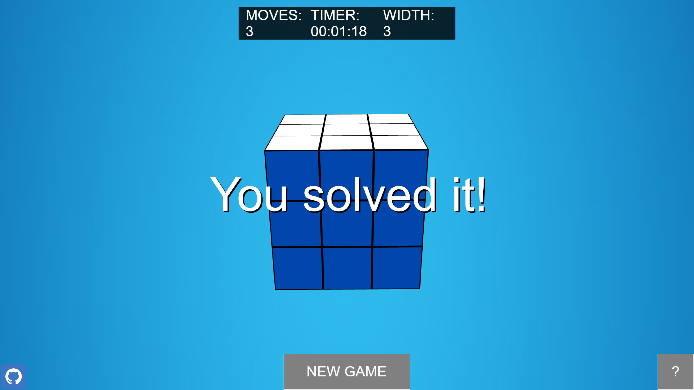
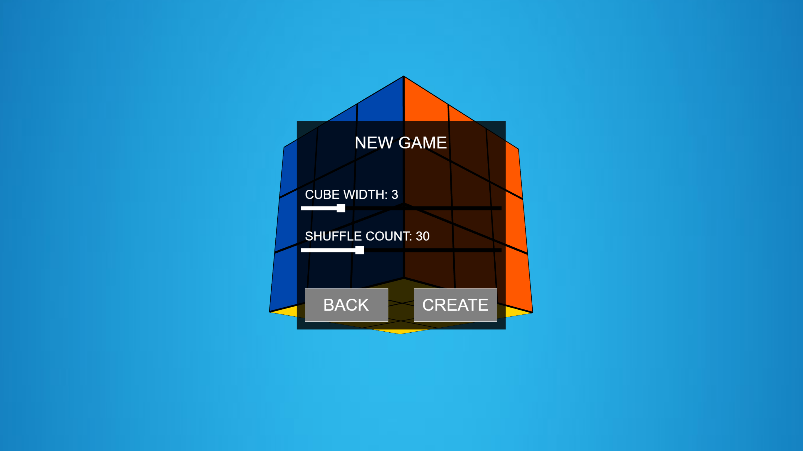
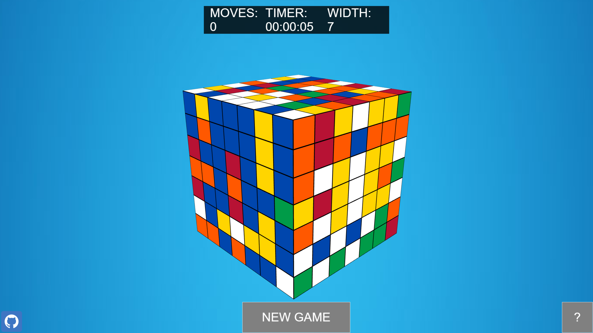

# [PLAY IT HERE (IN BROWSER)](https://gregorykau.github.io/Rubiks-Cube-Game/)
**Remember to unmute! Most browsers will mute by default.**

# Rubik's Cube Game
## With [BabylonJS](https://github.com/BabylonJS)
<div style="width: 100%; text-align: center">
    
</div>

A simple web-based implementation of the classic Rubik's Cube game using BabylonJS. 

...with the slight twist of allowing for N-sized cubes.

## Features:
- N-sized cubes for more ~~hair pulling frustration~~ fun.
- Intuitive directional dragging for performing segment rotations.
- Nice music (provided by [Axletree](https://freemusicarchive.org/music/Axletree/) via the FMA)
- Authentic Rubik's Cube rotation sound effects, recorded by yours truly.


## Usage:
- ```http-server``` in the local directory ([install here](https://github.com/http-party/http-server)). A dummy server is used to avoid a CORS violation which would be encountered if directly opening index.html in the browser due to cdnjs script inclusions.
- Then simply visit localhost:8081 to begin playing.

## Screenshots:






